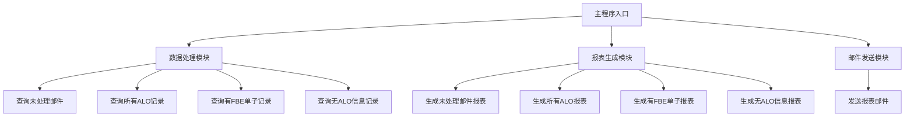
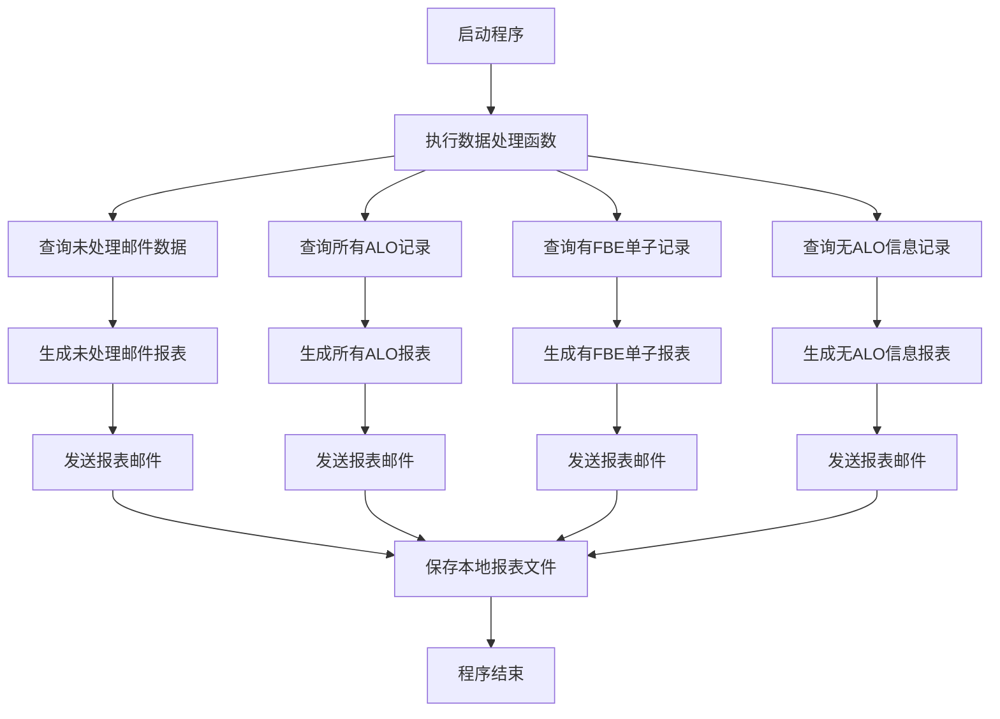

# 亚集邮件处理与报表生成系统说明文档

## 概述

这是一个自动化邮件处理和报表生成系统，专门用于处理亚集（Yaji）相关的邮件数据。系统能够从数据库中提取邮件信息，生成多种类型的HTML报表，并通过邮件自动发送给指定收件人。

## 功能特性

1. **多维度报表生成**：
   - 未处理邮件统计报表
   - 所有ALO邮件统计报表
   - 有FBE单子的ALO记录报表
   - 无ALO信息邮件统计报表

2. **邮件自动发送**：系统可自动将生成的报表通过邮件发送给指定用户

3. **交互式报表界面**：
   - 支持搜索功能
   - 支持点击查看详细信息
   - 响应式设计，适配不同设备

## 系统架构




## 核心模块说明

### 1. 数据库连接模块

```python
def get_mysql_connection():
    """
    获取MySQL数据库连接
    """
```


- 建立与MySQL数据库的安全连接
- 使用配置文件中的数据库参数
- 返回连接对象或None（连接失败时）

### 2. 数据查询模块

#### 2.1 查询未处理邮件数据

```python
def query_alo_and_booking_mapping():
    """
    查询yaji_email_records中当天记录的alo字段，
    并在yaji_main中查找对应的cds_booking_no
    """
```


- 查询当天状态为"未处理"的邮件记录
- 关联主数据表获取业务信息
- 返回匹配的记录列表

#### 2.2 查询所有ALO记录

```python
def query_all_alo_records():
    """
    查询yaji_email_records中当天的所有alo记录（包括已处理和未处理）
    """
```


- 查询当天所有ALO邮件记录
- 不区分处理状态
- 按接收时间倒序排列

#### 2.3 查询有FBE单子的ALO记录

```python
def query_alo_with_fbe_records():
    """
    查询yaji_email_records中当天有对应FBE单子的alo记录
    即在yaji_main中能找到对应booking_key且有fbe_no的记录
    """
```


- 通过INNER JOIN关联邮件表和主表
- 筛选有CDS编号的记录
- 返回匹配的记录列表

#### 2.4 查询无ALO信息邮件记录

```python
def query_no_alo_records():
    """
    查询yaji_email_records中当天没有alo信息的记录
    """
```


- 查询ALO字段为NULL或"无al0信息"的记录
- 返回邮件的基本信息和内容

### 3. 报表生成模块

#### 3.1 未处理邮件统计报表

```python
def generate_html_report2(data):
```


- 展示未处理邮件的详细信息
- 包含ID、Booking Key、CDS编号、FFC编号、状态和创建日期
- 支持主题切换和搜索功能

#### 3.2 所有ALO邮件统计报表

```python
def generate_all_alo_html_report(data):
```


- 展示当天所有ALO邮件记录
- 包含邮件ID、ALO编号、接收时间和处理状态
- 使用不同图标区分已处理和未处理状态

#### 3.3 有FBE单子的ALO记录报表

```python
def generate_alo_with_fbe_html_report(data):
```


- 展示有对应FBE单子的ALO记录
- 包含邮件ID、ALO编号、CDS编号、接收时间和状态
- 关联显示业务数据

#### 3.4 无ALO信息邮件统计报表

```python
def generate_no_alo_html_report(data):
```


- 展示无ALO信息的邮件记录
- 包含ID、消息ID、主题、接收时间和状态
- 支持点击查看邮件详细内容
- 提供全文搜索功能

### 4. 邮件发送模块

```python
def send_email_report(html_content, recipients, subject=None):
```


- 通过SMTP协议发送HTML格式邮件
- 支持多个收件人
- 可自定义邮件主题

## 使用流程




## 配置说明

### 数据库配置

```python
MYSQL_CONFIG = {
    'host': 'localhost',
    'port': 3306,
    'user': 'root',
    'password': 'your_password',
    'database': 'yaji_db',
    'charset': 'utf8mb4'
}
```


### 邮件配置

```python
EMAIL_CONFIG = {
    'smtp_server': 'smtp.em.dingtalk.com',
    'smtp_port': 25,
    'sender_email': 'qiyz@smartebao.com',
    'sender_password': 'your_password',
    'sender_name': 'qiyz@smartebao.com'
}
```


## 报表字段说明

### 未处理邮件统计报表字段

| 字段名 | 说明 |
|--------|------|
| ID | 记录唯一标识 |
| Booking Key (ALO) | ALO编号 |
| CDS Booking No | CDS预订号 |
| FFC No | FFC编号 |
| 状态 | 处理状态 |
| 创建日期 | 记录创建时间 |

### 所有ALO邮件统计报表字段

| 字段名 | 说明 |
|--------|------|
| ID | 邮件记录ID |
| ALO编号 | ALO编号 |
| 接收时间 | 邮件接收时间 |
| 状态 | 邮件处理状态 |

### 有FBE单子的ALO记录报表字段

| 字段名 | 说明 |
|--------|------|
| 邮件ID | 邮件记录ID |
| ALO编号 | ALO编号 |
| CDS编号 | CDS预订号 |
| 接收时间 | 邮件接收时间 |
| 状态 | 处理状态 |

### 无ALO信息邮件统计报表字段

| 字段名 | 说明 |
|--------|------|
| ID | 邮件记录ID |
| 消息ID | 邮件消息ID |
| 主题 | 邮件主题 |
| 接收时间 | 邮件接收时间 |
| 状态 | 邮件处理状态 |

## 错误处理

系统包含完善的错误处理机制：

1. **数据库连接异常**：记录错误日志并返回None
2. **SQL查询异常**：捕获异常并返回空列表
3. **邮件发送异常**：记录错误信息并返回False
4. **文件保存异常**：捕获异常并返回None

## 部署要求

### 环境依赖

- Python 3.6+
- PyMySQL
- 标准库：smtplib, email, datetime, os

### 外部依赖

- MySQL数据库
- SMTP邮件服务器

## 使用方法

1. 配置数据库连接参数
2. 配置邮件发送参数
3. 设置收件人列表
4. 运行主程序

```bash
python yaji_maping_tip2.py
```


## 扩展性说明

系统采用模块化设计，易于扩展：

1. 可以轻松添加新的报表类型
2. 可以修改邮件模板和样式
3. 可以增加新的数据查询条件
4. 可以自定义报表发送策略

## 维护建议

1. 定期检查数据库连接配置
2. 监控邮件发送日志
3. 备份重要报表文件
4. 根据需要调整查询条件和报表字段

graph TD
    A[主程序入口] --> B[数据处理模块]
    A --> C[报表生成模块]
    A --> D[邮件发送模块]
    
    B --> B1[查询未处理邮件]
    B --> B2[查询所有ALO记录]
    B --> B3[查询有FBE单子记录]
    B --> B4[查询无ALO信息记录]
    
    C --> C1[生成未处理邮件报表]
    C --> C2[生成所有ALO报表]
    C --> C3[生成有FBE单子报表]
    C --> C4[生成无ALO信息报表]
    
    D --> D1[发送报表邮件]

核心模块说明
1. 数据库连接模块

def query_alo_and_booking_mapping():
    """
    查询yaji_email_records中当天记录的alo字段，
    并在yaji_main中查找对应的cds_booking_no
    """
def query_all_alo_records():
    """
    查询yaji_email_records中当天的所有alo记录（包括已处理和未处理）
    """

def query_alo_with_fbe_records():
    """
    查询yaji_email_records中当天有对应FBE单子的alo记录
    即在yaji_main中能找到对应booking_key且有fbe_no的记录
    """
def query_no_alo_records():
    """
    查询yaji_email_records中当天没有alo信息的记录
    """
def generate_html_report2(data):
def generate_all_alo_html_report(data):
def generate_alo_with_fbe_html_report(data):
def generate_no_alo_html_report(data):
def send_email_report(html_content, recipients, subject=None):

flowchart TD
    A[启动程序] --> B[执行数据处理函数]
    B --> C[查询未处理邮件数据]
    B --> D[查询所有ALO记录]
    B --> E[查询有FBE单子记录]
    B --> F[查询无ALO信息记录]
    C --> G[生成未处理邮件报表]
    D --> H[生成所有ALO报表]
    E --> I[生成有FBE单子报表]
    F --> J[生成无ALO信息报表]
    G --> K[发送报表邮件]
    H --> L[发送报表邮件]
    I --> M[发送报表邮件]
    J --> N[发送报表邮件]
    K --> O[保存本地报表文件]
    L --> O
    M --> O
    N --> O
    O --> P[程序结束]

MYSQL_CONFIG = {
    'host': 'localhost',
    'port': 3306,
    'user': 'root',
    'password': 'your_password',
    'database': 'yaji_db',
    'charset': 'utf8mb4'
}

EMAIL_CONFIG = {
    'smtp_server': 'smtp.em.dingtalk.com',
    'smtp_port': 25,
    'sender_email': 'qiyz@smartebao.com',
    'sender_password': 'your_password',
    'sender_name': 'qiyz@smartebao.com'
}


